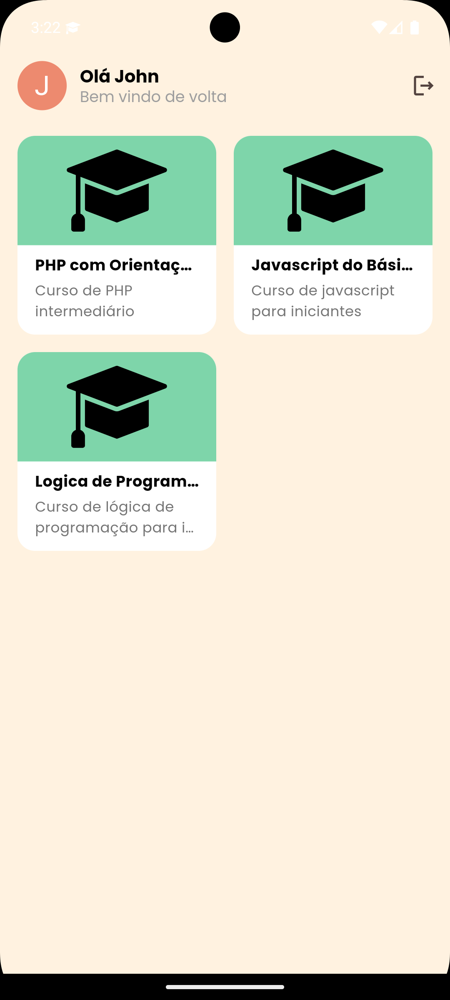
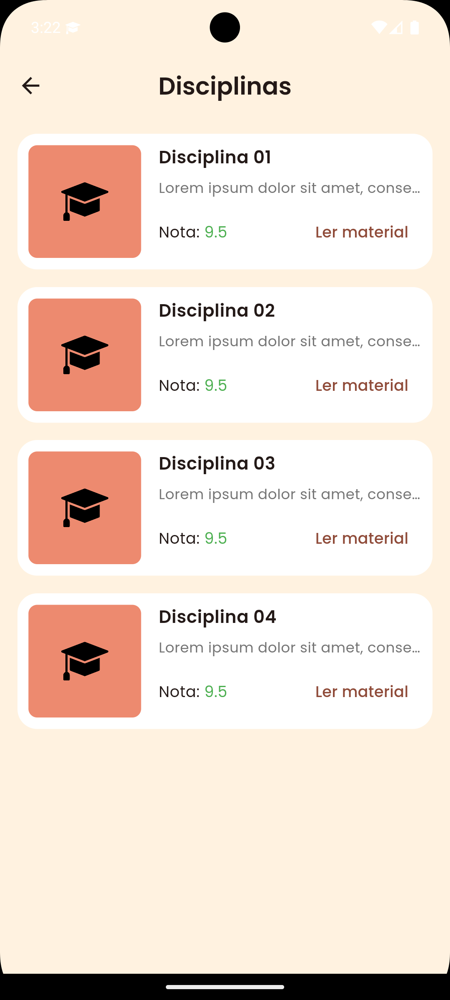

# Desafio grupo Prominas App

## Screenshots

<table>
  <tr>
    <td>Login</td>
    <td>Home Page</td>
    <td>Course Detail</td>
    <td>Material PDF Page</td>
  </tr>
  <tr>
     <td></td>
     <td></td>
     <td></td>
     <td></td>
  </tr>
</table>

## Desenvolvido com

- [Flutter](https://flutter.dev/)
- [Dart](https://dart.dev/)

# Features

1) Construir a tela do login, validando e-mail e senha ou acesso google/apple pelo firebase.
Notificação push ao logar. (Apenas para validar).
2) Listagem de cursos cadastrados em um banco. Api de preferência em node para
consultar os dados.
3) Botão de acesso ao curso e dentro do curso lista as disciplinas e nota que o aluno
obteve tudo fictício.
3.1) Dentro das disciplinas um botão para acessar um material que será um PDF (pode usar qualquer um, o usuário deve ser capaz de ler o mesmo pelo app)
4) Pensar na navegação onde o aluno possa ir no curso e voltar na tela inicial navegando.
